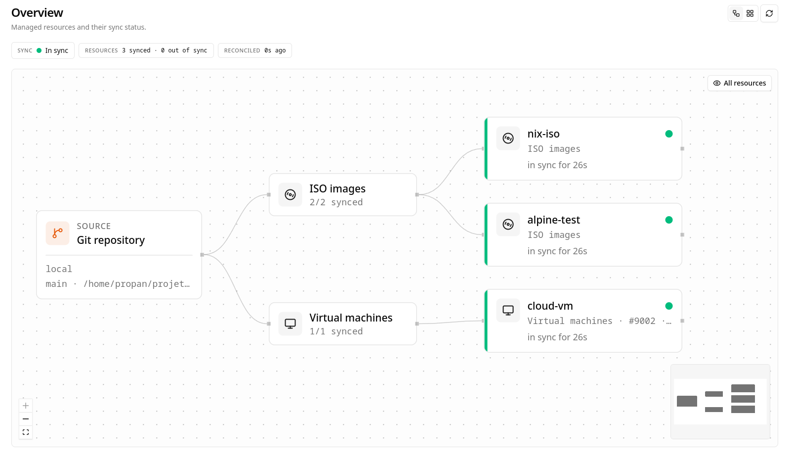
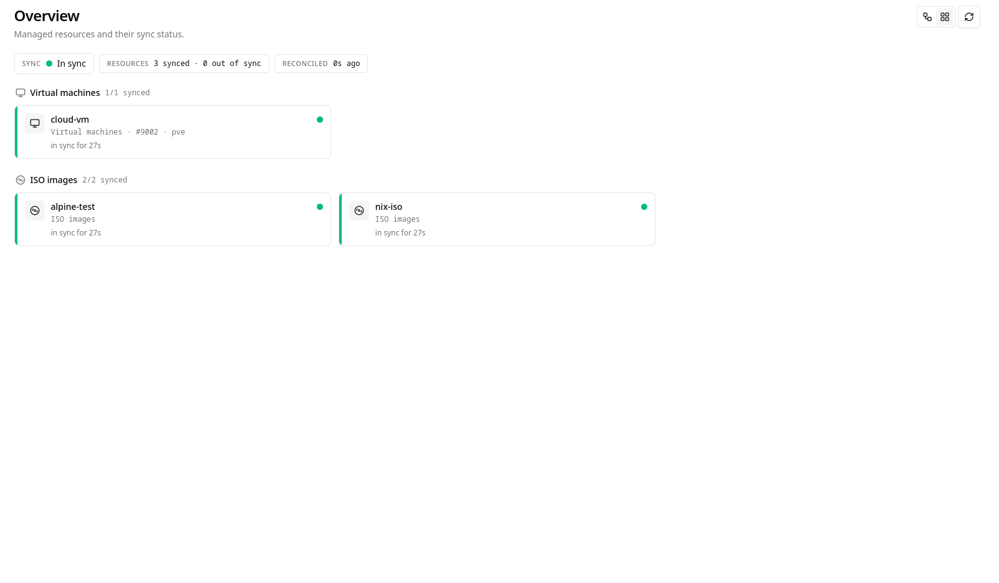
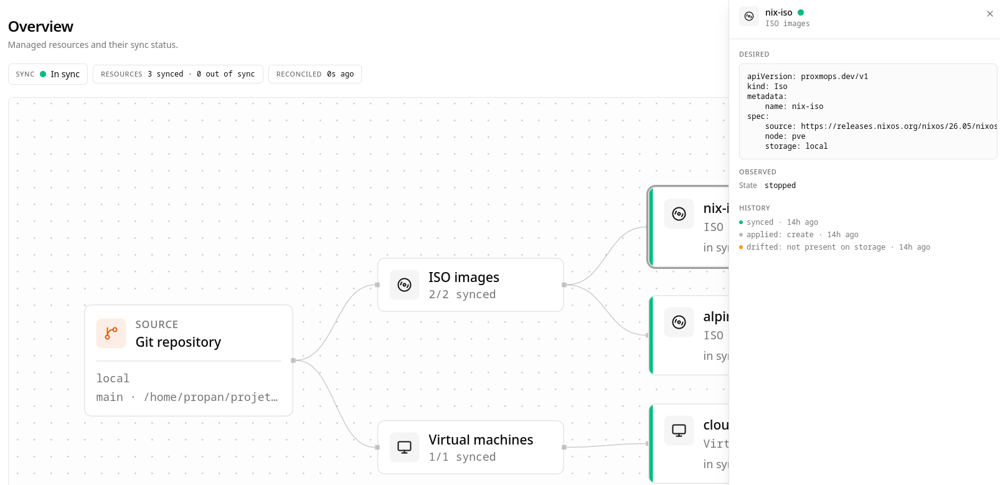
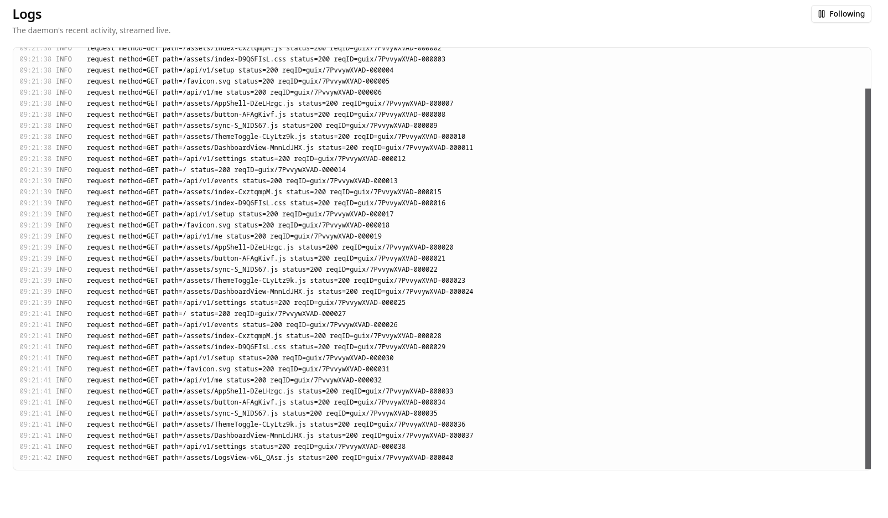

# proxmops

Declarative GitOps for Proxmox VE. Point it at a Git repository and it keeps your
cluster matching what the repository says, continuously. Think ArgoCD, for
Proxmox.

> Status: early but usable. VMs (including cloud-init) and ISOs are reconciled end
> to end. Containers and networks are not applied yet. Not affiliated with or
> endorsed by Proxmox Server Solutions GmbH.

## Why

Proxmox clusters drift. VMs get resized by hand, ISOs are uploaded to one node and
forgotten on another, tags rot, and six months later nobody remembers why a guest
is configured the way it is. There is no single source of truth, no review before
a change lands, and no clean way to roll back.

proxmops moves the desired state of the cluster into a Git repository. It reads
that repository and reconciles the live cluster to match. Git becomes the source
of truth, changes go through pull requests, and a rollback is a revert.

```
Git repo (desired state)  ->  proxmops  ->  Proxmox cluster (observed state)
        ^                                             |
        |_______________ reconcile loop _____________|
```

## Interface

The daemon serves a web dashboard in the spirit of the ArgoCD UI. The overview
shows every managed resource and its sync status, as an interactive topology graph
or as grouped cards. Clicking a resource opens a detail drawer with its desired
manifest next to the observed cluster state, its history, and a delete action. A
logs page tails the daemon live.









## What works today

- One static binary with the web UI embedded. No runtime dependencies and no
  separate database server.
- Web UI with first-run setup, login, and sessions. The cluster connection and
  Git source are configured from the UI and stored encrypted at rest. The
  encryption key is generated automatically on first start.
- Git source: clone and pull with token auth, or read a local path, watching a
  configurable sub-directory. The commit the cluster is reconciled against is
  shown in the UI.
- Manifests: multi-document YAML for VirtualMachine, Template, Iso, Container, and
  Network, validated on load.
- Reconcile loop with live status over Server-Sent Events, and a background
  dispatcher so a slow action (a large image download) never blocks the next scan.
- VMs, reconciled end to end: create, delete, and safe drift correction of cores,
  memory, CPU type, power state, and cloud-init scalars. Changes that need a
  restart are reported, or applied automatically with `applyMode: reboot`.
- Cloud-init: build a VM from a cloud image (downloaded from a URL or referenced
  from a storage), inject user, password, SSH keys, IP, and DNS.
- Templates: build a golden image from a cloud image and convert it to a Proxmox
  template.
- ISOs: download onto a target storage with checksum verification, and delete.
- Delete a resource from the UI. It is a one-shot delete; if the manifest is still
  in the repository it is recreated on the next pass, which is handy for forcing a
  re-download.
- Per-resource history persisted across restarts (created, drifted, synced,
  applied, failed, with the commit and timestamp), shown as a timeline in the
  detail drawer.
- Daemon logs page, a live tail of recent activity.
- `plan` command: a read-only diff between repository and cluster, for CI or a
  pre-flight check.

Containers and networks are defined in the schema but not applied yet. See the
roadmap.

## Core concepts

Desired versus observed state. The repository holds desired state. The Proxmox API
reports observed state. proxmops computes the difference and closes the gap.

Ownership by tag. proxmops only manages guests it owns, marked with a
`managed-by-proxmops` tag. Anything it did not create is left alone.

Opt-in prune. Removing a manifest from the repository marks the resource for
deletion, but the deletion only runs when prune is enabled. With prune off the
resource is reported as out of sync and left in place. Guests without the
ownership tag are never touched.

Drift correction. When an owned resource diverges from the repository, proxmops
reports it as out of sync and, in auto-sync mode, restores the desired state.

## Manifests

One file per resource, Kubernetes style. Group them into directories however you
like under the watched path; the tree is scanned recursively.

A cloud-init VM built from a cloud image (`.qcow2`, `.raw`, or `.vmdk`). proxmops
downloads the image, imports it as the disk, adds a cloud-init drive, and injects
the settings:

```yaml
apiVersion: proxmops.dev/v1
kind: VirtualMachine
metadata:
  name: app-01
  node: pve-node1
  tags: [prod, app]
spec:
  vmid: 120
  cores: 2
  memory: 2048
  cpu: x86-64-v2            # optional, defaults to the Proxmox default
  image:
    source: https://cloud.debian.org/images/cloud/bookworm/latest/debian-12-genericcloud-amd64.qcow2
  disks:
    - storage: local-lvm
      size: 20G             # grows the imported disk
  net:
    - bridge: vmbr0
  cloudInit:
    user: debian
    sshKeys:
      - ssh-ed25519 AAAA...
    ip: dhcp                # or "ip=10.0.0.5/24,gw=10.0.0.1"
    nameserver: 1.1.1.1
  applyMode: reboot         # optional, restart to apply cores/memory changes
  state: running
```

`image.source` also accepts a volume already on a storage, so an existing image is
used without re-downloading:

```yaml
  image:
    source: local:import/debian-12-genericcloud-amd64.qcow2
```

A template, built from an image and converted to a Proxmox template:

```yaml
apiVersion: proxmops.dev/v1
kind: Template
metadata:
  name: debian-12-tpl
  node: pve-node1
spec:
  vmid: 9000
  image:
    source: https://cloud.debian.org/images/cloud/bookworm/latest/debian-12-genericcloud-amd64.qcow2
  cores: 2
  memory: 2048
  disks:
    - storage: local-lvm
      size: 10G
  net:
    - bridge: vmbr0
```

A VM cloned from a declared template, with its own cloud-init. `fromTemplate`
accepts a template name (a full clone) or an object with `linked: true` for a
copy-on-write clone. It is mutually exclusive with `image`:

```yaml
apiVersion: proxmops.dev/v1
kind: VirtualMachine
metadata:
  name: app-02
  node: pve-node1
spec:
  vmid: 130
  fromTemplate: debian-12-tpl     # or { name: debian-12-tpl, linked: true }
  cores: 2
  memory: 2048
  disks:
    - storage: local-lvm
      size: 20G                   # grows the cloned disk
  cloudInit:
    user: app
    sshKeys:
      - ssh-ed25519 AAAA...
    ip: dhcp
  state: running
```

An ISO synced onto a storage, with an optional checksum:

```yaml
apiVersion: proxmops.dev/v1
kind: Iso
metadata:
  name: debian-12
spec:
  source: https://cdimage.debian.org/.../debian-12-amd64-netinst.iso
  node: pve-node1
  storage: local
  checksum:
    algo: sha256
    value: 0123abcd...
```

Containers and networks have manifests too, but they are not reconciled yet:

```yaml
apiVersion: proxmops.dev/v1
kind: Container
metadata:
  name: dns-01
  node: pve-node1
spec:
  vmid: 201
  cores: 1
  memory: 512
  rootfs:
    storage: local-lvm
    size: 8G
  net:
    - bridge: vmbr0
      ip: 10.0.0.53/24
      gw: 10.0.0.1
  template: debian-12-standard
  state: running
```

### Repository layout

```
your-repo/
  proxmox/                 # the path proxmops watches
    vms/
      app-01.yaml
    templates/
      debian-12-tpl.yaml
    isos/
      debian-12.yaml
  ... other unrelated content, ignored ...
```

The watched path is configurable, so proxmops can live inside a monorepo next to
unrelated files. Everything outside that path is ignored.

## Install

proxmops is a single static binary with the web UI embedded. It talks to Proxmox
over the API, so it can run on a PVE node, in an LXC or VM, or anywhere with
network access to the cluster.

One line:

```sh
curl -fsSL https://raw.githubusercontent.com/prop4n/proxmops/main/packaging/install.sh | sh
```

The script downloads the latest release for your architecture (checksum verified),
installs the binary to `/usr/local/bin`, sets up a hardened systemd service, and
starts it. On first start the daemon creates its state directory at
`/var/lib/proxmops` and generates the secret-encryption key automatically
(`proxmops.db.key`, mode `0600`). You never create or manage that key by hand.
Open `http://<host>:8080` to finish setup from the UI.

Pin a version with `PROXMOPS_VERSION=v1.2.3`. Remove everything, keeping your
state and config, with `... | sh -s -- --uninstall`.

Docker:

```sh
docker run -d -p 8080:8080 \
  -v proxmops-data:/data \
  -e PROXMOPS_SERVER_DATABASEPATH=/data/proxmops.db \
  ghcr.io/prop4n/proxmops:latest
```

The key is generated next to the database inside the volume, so it survives
restarts.

## Configuration

The normal path is to configure nothing by hand. Start the daemon, open the UI,
and fill in the cluster connection and Git source under Settings. Those are stored
encrypted in the database and take precedence over any file, so they apply without
a restart.

A config file, and matching `PROXMOPS_*` environment variables, is also supported
for pre-seeding or air-gapped setups:

```yaml
cluster:
  endpoint: https://pve.example.com:8006/api2/json
  tokenId: proxmops@pve!gitops
  tokenSecret: ${PROXMOPS_CLUSTER_TOKENSECRET}   # from env, never inline
  insecureSkipVerify: false

source:
  repoURL: https://github.com/you/homelab.git
  path: proxmox               # sub-directory watched inside the repo
  revision: main

reconcile:
  interval: 60s
  autoSync: true              # apply automatically; false is detect-only
  prune: true                 # allow deleting owned resources dropped from repo
  concurrency: 4              # how many actions apply in parallel
  dryRun: false
```

Authentication uses a Proxmox API token, so proxmops runs with a scoped, revocable
identity rather than a root login. Secrets (the cluster token and the Git token)
are read from the environment or a file, never stored inline.

## Architecture

proxmops is a reconciliation engine wrapped in a control loop, plus a thin HTTP
layer that serves the API and the embedded UI.

```
  Git repo (path)
        |
        v
  Loader / Parser        loads and validates manifests
        |
        v  desired state
  Reconcilers  <-------  Proxmox API client   observed state
   (guest, template,
    iso)
        |  plan (create / update / delete)
        v
  Dispatcher             applies actions in the background, bounded
        |
        v
  Proxmox cluster

  Control loop  ->  Status store  ->  Web UI / API (SSE)
       |
       +-> SQLite: accounts, sessions, encrypted settings, resource history
       +-> Log ring buffer -> logs page (SSE)
```

The engine (loader, reconcilers, dispatcher) has no knowledge of the control loop
or the HTTP layer, so the same core powers both the daemon and the read-only
`plan` command. Each resource family has its own reconciler, so the kinds that
reconcile differently stay isolated.

The reconcile loop never blocks on an action. It scans, records status, and hands
applicable actions to a bounded dispatcher that runs them in the background and
de-duplicates in-flight work. Drift that appears while an earlier action is still
running is caught on the very next scan.

State lives in a local SQLite database (accounts, sessions, encrypted settings,
per-resource history). The Proxmox connection uses an API token; failed Proxmox
tasks surface their exit status rather than being reported as success.

## Safety

Managing infrastructure declaratively is powerful and therefore dangerous. The
defaults lean cautious.

- Ownership isolation. Only tagged, proxmops-owned guests are ever modified or
  deleted.
- Opt-in prune. Deleting resources dropped from the repository happens only when
  prune is enabled.
- Detect-only mode. With auto-sync off, proxmops reports drift and plans without
  touching the cluster.
- Encrypted secrets. Cluster and Git tokens are encrypted at rest under a locally
  held key.

## Roadmap

Done:

- [x] Git source: clone and pull, token auth, configurable path, commit shown
- [x] Manifest schema and loader
- [x] Reconcile loop with a background dispatcher and live status over SSE
- [x] Auth and encrypted settings from the UI
- [x] ISO sync with checksum verification, and delete
- [x] VM lifecycle: create, update (cores, memory, CPU, state, cloud-init), delete
- [x] Cloud-init from a cloud image (URL or local volume)
- [x] Templates: build and convert
- [x] Clone a VM from a template with per-clone cloud-init
- [x] Delete from the UI, opt-in prune
- [x] Per-resource history and a live daemon logs page
- [x] Resource detail drawer: desired versus observed, history, actions

Next:

- [ ] Container (LXC) apply
- [ ] Guest disk and NIC drift detection and correction
- [ ] Network and storage reconciliation
- [ ] Support cloud images served with a `.img` extension (Ubuntu)
- [ ] Explicit adoption of existing guests
- [ ] UI: dry-run preview, pull-request impact preview, filters
- [ ] History retention cap
- [ ] Later: Git webhook triggers, health checks, multi-cluster

## Development

Requires Go and [Bun](https://bun.sh) for the web UI.

```sh
# Backend
go test ./...
go build ./cmd/proxmops

# Web UI, from web/ui
bun install
bun run build      # emits dist/, embedded into the Go binary
bun run test       # vitest
```

Releases are cut with GoReleaser (`.goreleaser.yaml`): static linux and darwin
binaries with the UI embedded, plus the `checksums.txt` the installer verifies.

## Status

Early and incomplete. Interfaces and the manifest schema will change. Not
affiliated with or endorsed by Proxmox Server Solutions GmbH.
